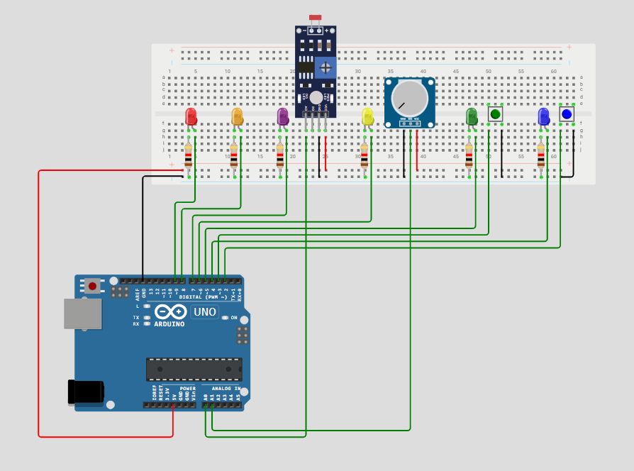
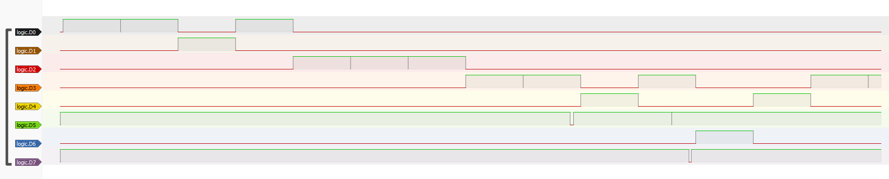

# Upravljanje višestrukim prekidima i njihovim prioritetima

## Sadržaj

1. [Opis sustava](#opis-sustava)
2. [Hardverske komponente](#hardverske-komponente)
3. [Shema](#shema)
4. [Rukovanje prekidima](#rukovanje-prekidima)
5. [Funkcionalni zahtjevi](#funkcionalni-zahtjevi)
6. [Logički analizator](#logicki-analizator)
7. [Testiranje](#testiranje)

## 1. Opis sustava

Sustav implementira obradu višestrukih prekida s različitim prioritetima koristeći:

- 2 tipkala za generiranje prekida
- 6 LED dioda za vizualizaciju različitih prekida
- Fotootpornik kao analogni ulaz koji generira prekid nakon prelaska određene granice
- Potenciometar kao analogni ulaz koji generira prekid nakon prelaska određene granice
- Timer koji generira periodične prekide
- Arduino Uno mikrokontroler

Svaki prekid se obrađuje zasebno. Kada dođe prekid višeg prioriteta, on se obrađuje prvi. U tom trenutku ostali prekidi čekaju obradu i obrađuju se prema njihovom redoslijedu (prioritetu). U određenom trenutku može biti uključena samo jedna LED dioda koja definira prekid koji se obrađuje. Sustav koristi millis() umjesto delay() gdje je to moguće kako bi osigurao nesmetano upravljanje prekidima.

## 2. Hardverske komponente

| Komponenta           | Količina | Pin                 |
| -------------------- | -------- | ------------------- |
| Arduino Uno          | 1        | -                   |
| Pločica za spajanje  | 1        | -                   |
| Tipkalo              | 2        | 2, 3                |
| LED (razne boje)     | 6        | 4, 5, 6, 7, 8, 9    |
| Otpornik 1kΩ         | 6        | -                   |
| Fotootpornik         | 1        | A0                  |
| Potenciometar        | 1        | A1                  |
| Logički analizator   | 1        | -                   |

## 3. Shema

## 4. Rukovanje prekidima

Sustav obrađuje prekide uzrokovane različitim senzorima i korisničkim ulazima. Prioriteti prekida su sljedeći:
 
1. **Tipkala (INT0 > INT1)** - Ako je tipkalo pritisnuto pali se LED dioda u njegovoj boji i u Serial monitor se ispisuje poruka "Prekid - tipkalo 2 pritisnuto!" ako je pritisnuto zeleno tipkalo ili "Prekid - tipkalo pritisnuto (najviši prioritet)!" ako je pritisnuto plavo tipkalo.
2. **Potenciometar** - Pali žutu LED diodu kada je pročitana vrijednost veća od 512. U Serial monitor se ispisuje poruka "Prekid - potenciometar ima veću vrijednost od 512!"
3. **Fotootpornik** - Pali ljubičastu LED diodu kada je pročitana vrijednost razine osvjetljenja manja od 300 luksa. U Serial monitor se ispisuje poruka "Prekid - osvjetljenje je manje od 300 luksa!"
4. **Serijski unos** - Ako se detektira unos podataka putem serijskog monitora pali se narančasta LED dioda i u Serial monitor se ispisuje poruka "Prekid - serijski ulaz!".
5. **Timer prekid** - Pali crvenu LED diodu svakih 1 sekundu i u Serial monitor ispisuje poruku "Prekid - timer!".

## 5. Funkcionalni zahtjevi

| ID     | Opis |
|--------|------|
| FR-1   | Sustav mora detektirati pritiske tipkala i aktivirati odgovarajuće LED diode. |
| FR-2   | Prekid tipkala mora imati definirane prioritete: INT0 > INT1. |
| FR-3   | Sustav mora očitavati vrijednost potenciometra. |
| FR-4   | Ako je očitana vrijednost veća od 512 žuta LED dioda mora svijetliti i mora se ispisati poruka "Prekid - potenciometar ima veću vrijednost od 512!" na Serial monitoru. |
| FR-5   | Sustav mora mjeriti razinu osvjetljenja s pomoću fotootpornika. |
| FR-6   | Ako je izmjerena razina osvjetljenja manja od 300 luksa, ljubičasta LED dioda mora svijetliti i mora se ispisati poruka "Prekid - osvjetljenje je manje od 300 luksa!" na Serial monitoru. |
| FR-7   | Sustav mora detektirati unos na Serial monitoru. |
| FR-8   | Ako postoji unos na Serial monitoru pali se narančasta LED dioda i ispisuje se poruka "Prekid - potenciometar ima veću vrijednost od 512!" na Serial monitoru. |
| FR-9   | Timer mora generirati prekid svake 1 sekunde i uključiti crvenu LED diodu na kratko. |
| FR-10  | Ako se istovremeno dogodi više prekida, mora se poštivati sljedeći prioritet: INT0 > INT1 > potenciometar > fotootpornik > serijski unos > Timer. |
| FR-11  | U određenom trenutku može biti upaljena samo jedna LED dioda koja označava prekid koji se obrađuje. |
| FR-12  | Implementacija mora koristiti millis() umjesto delay() gdje je moguće. |
| FR-13  | Implementacija logičkog analizatora za vizualizaciju promjene signala i provjeru ispravnosti izvršavanja prioriteta. |

## 6. Logički analizator

Logički analizator je uređaj koji se koristi za snimanje i analizu digitalnih signala u elektroničkim krugovima. Omogućuje korisnicima da vizualiziraju promjene u signalima na više kanala, čime se olakšava dijagnostika i testiranje kompleksnih sustava. Analizator radi tako da prati promjene u binarnim signalima (0 ili 1) i prikazuje ih u vremenskom razmaku, omogućujući analizu vremena trajanja i odnosa između različitih signala. Logički analizator je implementiran u ovom sustavu kako bi se potvrdilo ispravno izvršavanje prioriteta i pravovremena reakcija na događaje. Način spajanja logičkog analizatora u ovom projektu:

| Komponenta           | Pin      |
| -------------------- | -------- |
| Crvena LED dioda     | D0       |
| Narančasta LED dioda | D1       |
| Ljubičasta LED dioda | D2       |
| Žuta LED dioda       | D3       |
| Zelena LED dioda     | D4       |
| Zeleno tipkalo       | D5       |
| Plava LED dioda      | D6       |
| Plavo tipkalo        | D7       |
| GND                  | GND      |

Na sljedećoj slici su vidljivi digitalni signali snimljeni pomoću logičkog analizatora.

## 7. Testiranje

Kada se kod pokrene timer generira prekid svake sekunde što je detektirano paljenjem crvene LED diode, moguće je unijeti neki test u Serial monitor i taj serijski unos će imati prioritet te će se on obraditi (to je simulirano i paljenjem narančaste LED diode). Također, kada se fotootpornik namjesti na vrijednost manju od 300 luksa ljubičasta LED dioda će se upaliti i izvršavat će se taj prekid. Ako se u istom trenutku vrijednost na potenciometru postavi na veću od 512, pali se žuta LED dioda i izvršava se taj prekid. U slučaju da se pritisne neko od tipkala izvodi se njihov prekid i pali odgovarajuća LED dioda budući da tipkala imaju najviši prioritet. Tipkalo na pinu 2 (INT0) ima veći prioritet od tipkala na pinu 3 (INT1) te se njegov prekid izvršava prvi u slučaju da su tipkala pritisnuta istovremeno.
