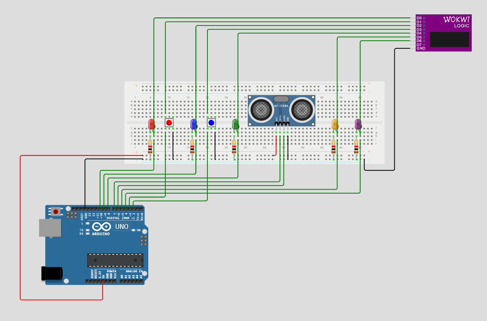
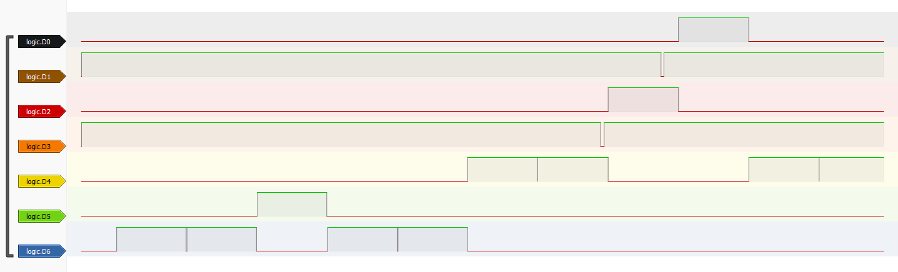

# Upravljanje višestrukim prekidima i njihovim prioritetima

## Sadržaj

1. [Opis zadatka](#opis-projekta)
2. [Hardverske komponente](#hardverske-komponente)
3. [Shema](#shema)
4. [Način rada sustava](#nacin-rada-sustava)
5. [Funkcionalni zahtjevi](#funkcionalni-zahtjevi)
6. [Logički analizator](#logicki-analizator)
7. [Testiranje](#testiranje)

## 1. Opis zadatka

U ovom zadatku je prikazano upravljanje višestrukim prekidima različitih prioriteta koristeći Arduino Uno mikrokontroler te nekoliko vanjskih komponenti. Implementacijom ovog sustava omogućeno je rukovanje prekidima generiranih pritiskom na tipkalo, očitavanjem vrijednosti senzora udaljenosti, serijskom komunikacijom te timerom koji generira prekide.

U izradi ovog zadatka koristile su se sljedeće komponente: 

- 2 tipkala za generiranje prekida prilikom pritiska (BUTTON1, BUTTON2)
- 5 LED dioda za vizualizaciju prekida
- HC-SR04 senzor udaljenosti
- Timer koji generira periodične prekide
- Arduino Uno mikrokontroler
- Logički analizator

**Funkcionalnosti**:

- Svaki prekid se posebno obrađuje ovisno o njegovom prioritetu
- U slučaju pojave prekida višeg prioriteta, drugi prekidi se stavljaju na čekanje
- Nakon što završi prekid višeg prioriteta redom se obrađuju ostali prekidi
- U određenom trenutku može biti aktivna samo jedna LED dioda, čime je naznačen prekid koji se obrađuje
- Implementacija koristi `millis()` umjesto `delay()` što osigurava veću efikasnost sustava

## 2. Hardverske komponente

| Komponenta        | Količina | Pin na Arduino Uno |
| ----------------- | -------- | ------------------- |
| Arduino Uno       | 1        | -                   |
| Pločica za spajanje| 1        | -                   |
| Tipkalo           | 2        | 2, 3                |
| LED (crvena)      | 1        | 12                  |
| LED (plava)       | 1        | 10                  |
| LED (zelena)      | 1        | 8                   |
| LED (narančasta)  | 1        | 5                   |
| LED (ljubičasta)  | 1        | 4                   |
| HC-SR04 senzor    | 1        | TRIG: 7, ECHO: 6    |
| Otpornik 1kΩ      | 5        | -                   |
| Logički analizator| 1        | -                   |

## 3. Shema

## 4. Način rada sustava

Sustav koristi mehanizam prekida za efikasno upravljanje događajima koji se odvijaju u stvarnom vremenu. Prekidi osiguravaju brzu reakciju na vanjske i unutarnje događaje bez potrebe za stalnim provjeravanje statusa tipkala ili senzora.

**Poredak prioriteta prekida:**
1. BUTTON1 (INT0) (najviši prioritet) - Aktivira se pritiskom na prvo tipkalo i uključuje crvenu LED diodu.
2. BUTTON2 (INT1) - Aktivira se pritiskom na drugo tipkalo i uključuje plavu LED diodu.
3. Senzor udaljenost (<50 cm) - Kada se detektira objekt na udaljenosti manjoj od 50 cm. Uključuje se zelena LED dioda.
4. Serijska komunikacija - Kada mikrokontroler primi podatke putem serijskog sučelja. Uključuje se narančasta LED dioda.
5. Timer prekid - Timer se aktivira svaku sekundu i uključuje ljubičastu LED diodu.

Kada se istovremeno aktivira više prekida, prvo se obrađuje onaj s najvišim prioritetom, a zatim se redom prelazi na prekide višeg prioriteta. Ovim pristupom osigurava se da najkritičniji događaji budu obrađeni što je prije moguće.

## 5. Funkcionalni zahtjevi

Tablica u nastavku prikazuje pregled funkcionalnosti koje su napravljene u zadatku:

| ID    | Opis |
|-------|------------------------------------------------------------|
| FR-1  | Sustav mora detektirati pritiske tipkala i aktivirati LED |
| FR-2  | Prekid BUTTON1 ima viši prioritet od BUTTON2. Kada se on aktivira pali se crvena LED dioda i u Serial monitor se ispisuje poruka "Prekid - Glavni gumb pritisnut (najviši prioritet)" |
| FR-3  | Prekid BUTTON2 je drugi po redu prioriteta. Kada se on aktivira u Serial monitor se ispisuje poruka "Prekid - Drugi gumb pritisnut" |
| FR-4  | Senzor udaljenosti prati udaljenost objekta od senzora |
| FR-5  | Ako senzor očita vrijednost manju od 50 cm pali se zelena LED dioda i u Serial monitor se ispisuje poruka "Prekid - Udaljenost manja od 50 cm" |
| FR-6  | Prijem podataka putem serijske komunikacije također mora generirati prekid |
| FR-7  | Ako dođe do prijema podataka putem serijske komunikacije pali se narančasta LED dioda i u Serial monitor se ispisuje poruka "Prekid - Serijska komunikacija aktivna" |
| FR-8  | Timer generira prekid svaku sekundu i pali ljubičastu LED diodu. U Serial monitoru se ispisuje poruka "Prekid - Timer aktivan" |
| FR-9  | Istovremeno može biti aktivna samo jedna LED dioda |
| FR-10 | Ako se istovremeno aktivira više prekida, obrađuje se onaj s najvećim prioritetom |
| FR-11 | Implementacija koristi `millis()` umjesto `delay()` kako bi se osigurala veća efikasnost sustava|
| FR-12 | Korištenje logičkog analizatora za provjeru izvršavanja prioriteta i reakcija na događaje|

## 6. Logički analizator

Logički analizator je uređaja koji omogućava praćenje i ispitivanje digitalnih signala u elektroničkm sustavima. Korisinicima pruža mogućnost vizualiazcije promjena na više kanala čime je olakšana identifikacija problema i testiranje složenih sustava. Uređaj funkcionira praćenjem varijacija binarnih signala (0 ili 1) te ih prikazuje u vremenskom intervalu, omogućujući analizu trajanja signala i njihovih međusobnih odnosa. Logički analizator je integriran u ovaj sustav kako bi se osigurala pravilna provedba prioriteta i pravovremena reakcija na dogđaje.

U nastavku se nalazi tablica sa popisom komponenti koje su spojene na odgovarajuće pinove logičkog analizatora.

| Komponenta        | Pin      |
| ----------------- | -------- |
| LED (crvena)      | D0       |
| Crveno tipkalo    | D1       |
| LED (plava)       | D2       |
| Plavo tipkalo     | D3       |
| LED (zelena)      | D4       |
| LED (narančasta)  | D5       |
| LED (ljubičasta)  | D6       |
| GND               | GND      |

Na slici ispod su vidljivi digitalni signali snimljeni pomoću logičkog analizatora.

## 7. Testiranje

Testiranje sustava provedeno je simulacijom različitih vrsta prekida i praćenjem reakcija mikrokontrolera. Pritiskom na tipkala provjerena je ispravna aktivacija crvene i plave LED diode, pri čemu je prekid BUTTON1 ima viši prioritet. Senzor udaljenosti uspješno detektira objekte bliže od 50 cm, aktivira zelenu LED diodu i ispisuje odgovarajuću poruku u serijskom monitoru. Prijenos podataka putem serijske komunikacije ispravno generira prekid i uključi narančastu LED diodu. Timer svaku sekundu aktivira ljubičastu LED diodu. Testiranjem je utvrđeno da sustav poštuje prioritet prekida i ispravno obrađuje događaje prema definiranom redoslijedu.
