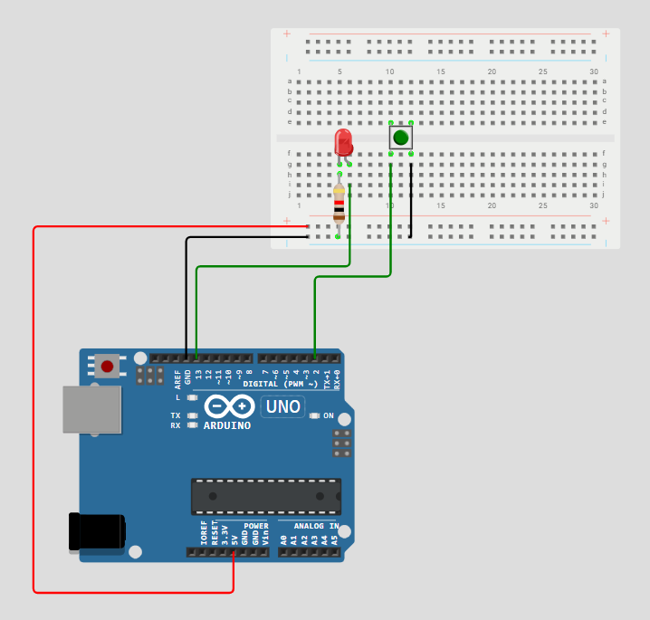

# Upravljanje potrošnjom energije mikrokontrolera korištenjem sleep moda

## Sadržaj
1. [Opis sustava](#opis-sustava)
2. [Hardverske komponente](#hardverske-komponente)
3. [Shema](#shema)
4. [Opis funkcionalnosti](#opis-funkcionalnosti)
5. [Funkcionalni zahtjevi](#funkcionalni-zahtjevi)
6. [Usporedba Sleep modova](#usporedba-sleep-modova)
7. [Testiranje](#testiranje)

## 1. Opis sustava

Sustav omogućuje upravljanje potrošnjom energije korištenjem Sleep moda koristeći:

- Tipkalo koje generira eksterni prekid
- Watchdog timer koji generira prekid svakih 8 sekundi
- Arduino Uno mikrokontroler

Ovaj sustav prikazuje kako se može postići energetski učinkovito upravljanje radom mikrokontrolera Arduino Uno korištenjem sleep modova i prekidnih mehanizama. U ovom radu je implementiran `SLEEP_MODE_PWR_DOWN` sleep mod. Time je omogućena minimalna potrošnja energije i aktiviranje mikrokontrolera samo kada je to potrebno (kada se pritisne tipkalo ili nakon isteka vremena definiranog watchdog timerom).
Zahvaljujući ovom načinu rada, sustav je posebno pogodan za primjene u kojima je dugotrajan rad na baterijsko napajanje ključan. To uključuje uređaje poput pametnih senzora, vremenskih stanica i drugih IoT rješenja koji zahtijevaju povremenu aktivnost uz minimalnu potrošnju između tih aktivnosti.

## 2. Hardverske komponente

| Komponenta          | Količina | Pin        |
|---------------------|----------|------------|
| Arduino Mega        | 1        | -          |
| Pločica za spajanje | 1        | -          |
| LED dioda (crvena)  | 1        | 13         |
| Otpornik 1kΩ        | 1        | -          |
| Tipkalo             | 1        | 2          |

## 3. Shema

## 4. Opis funkcionalnosti

1. LED svijetli 5 sekundi.
2. Arduino ulazi u sleep mode (`SLEEP_MODE_PWR_DOWN`).
3. Buđenje je moguće s pomoću tipkala (eksterni prekid INT0) ili watchdog timera (~8 sekundi).
4. Nakon buđenja, Serial monitor prikazuje uzrok buđenja.
5. Postupak se ponavlja.

## 5. Funkcionalni zahtjevi

| ID   | Opis                                                                                                                                  |
|------|---------------------------------------------------------------------------------------------------------------------------------------|
| FR-1 | LED mora svijetliti 5 sekundi nakon pokretanja. Za to vrijeme se u Serial monitoru mora ispisivati poruka "LED dioda svijetli (5s)".  |
| FR-2 | Sustav mora ući u sleep mode, ugasiti LED diodu i u Serial monitor ispisati poruku "Ulazak u sleep mode!".                            |
| FR-3 | Sustav se mora probuditi pritiskom na tipkalo (eksterni prekid).                                                                      |
| FR-4 | Sustav se mora probuditi nakon isteka watchdog timera (~8 sekundi).                                                                   |
| FR-5 | Serial monitor mora ispisati uzrok buđenja.                                                                                           |
| FR-6 | Sustav mora koristiti SLEEP_MODE_PWR_DOWN za efikasno upravljanje energijom.                                                          |

## 6. Usporedba sleep modova

Arduino mikrokontroleri temeljeni na AVR arhitekturi (poput ATmega328P) nude više različitih sleep modova, koji omogućuju precizno upravljanje potrošnjom energije ovisno o potrebama aplikacije. Svaki od tih modova isključuje određene dijelove sustava i omogućuje buđenje putem željene logike (npr. prekidi ili timer kao što je korišteno i u ovom radu).

### Idle mod
U ovom načinu rada CPU se zaustavlja, no ostali sustavi kao što su timeri, ADC i komunikacijski moduli (npr. UART) ostaju aktivni. Ovaj mod je koristan kada je potrebna brza obrada nakon kratkog zastoja, ali nije idealan za dugotrajne periode niske potrošnje.

### Power-down mod
U Power-down načinu rada gotovo svi interni moduli se isključuju, uključujući oscilatore, ADC i timere. Buđenje je moguće samo s pomoću eksternih prekida ili watchdog timera. Ovaj mod pruža najveću uštedu energije i koristi se kada su dugi periodi mirovanja poželjni.

### Standby mod
Standby mod je sličan Power-down modu, ali glavni oscilator ostaje aktivan. To omogućuje znatno brže buđenje u odnosu na Power-down, ali i nešto veću potrošnju energije. Ovaj mod je balans između brzine buđenja i uštede energije.

Sljedeća tablica prikazuje usporedbu modova po potrošnji energije, vremenu buđenja i fleksibilnosti konfiguracije.

| Sleep mod     | Potrošnja energije  | Vrijeme buđenja  | Fleksibilnost konfiguracije         |
|---------------|---------------------|------------------|-------------------------------------|
| Idle          | 2–5 mA              | <1 µs            | Vrlo fleksibilan (periferije rade)  |
| Power-down    | <1 µA               | 4–6 ms           | Ograničena (samo vanjski izvori)    |
| Standby       | ~10 µA              | ~1 ms            | Srednja (oscilator ostaje aktivan)  |

Zaključno, odabir odgovarajućeg sleep moda ovisi o specifičnim zahtjevima projekta. Ako je najvažnija niska potrošnja i rijetka aktivacija sustava, Power-down mod je najbolji izbor. Za sustave koji zahtijevaju brzo reagiranje uz uštedu energije, Standby predstavlja optimalno rješenje. Idle se koristi u slučajevima gdje je potrebno održavati funkcionalnost perifernih modula uz minimalno opterećenje CPU-a.

U ovom projektu korišten je Power-down mod, jer pruža najveću uštedu energije. S obzirom na to da se sustav budi samo u slučaju eksternog prekida (pritisak tipkala) ili putem watchdog timera, nije bilo potrebe za aktivnim perifernim uređajima tijekom mirovanja. Zbog toga je ovaj način rada idealan za minimiziranje potrošnje, čime se omogućuje energetski učinkovito ponašanje mikrokontrolera.

## 7. Testiranje

Kada se kod pokrene LED dioda svijetli 5 sekundi, čime je jasno definirano aktivno stanje. Nakon 5 sekundi se LED dioda isključuje i u Serial monitoru se ispisuje poruka "Ulazak u sleep mode!". Ako se pritisne tipkalo, LED dioda se ponovno pali na 5 sekundi i u Serial monitoru se ispisuje "Buđenje: Eksterni prekid (tipkalo).". Ako se ništa ne pritisne, nakon ~8 sekundi LED dioda se pali i u Serial monitoru se ispisuje "Buđenje: Watchdog timer."
