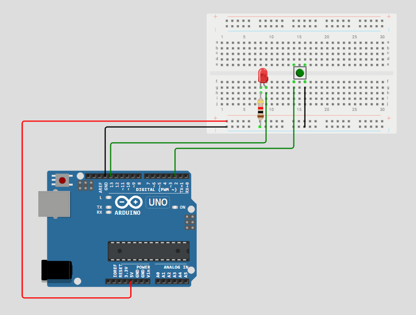

# Upravljanje potrošnjom energije mikrokontrolera korištenjem sleep moda

## Sadržaj

1. [Opis projekta](#opis-projekta)  
2. [Hardverske komponente](#hardverske-komponente)  
3. [Shema](#shema)  
4. [Način rada sustava](#nacin-rada-sustava)  
5. [Funkcionalni zahtjevi](#funkcionalni-zahtjevi)
6. [Istraživanje različitih razina sleep moda](#istrazivanje-razlicitih-razina-sleep-moda)
7. [Testiranje](#testiranje)  

## 1. Opis projekta

Ovaj zadatak demonstrira upravljanje potrošnjom energije Arduino Uno mikrokontrolera korištenjem watchdog timera i eksternog prekida preko tipkala. Sustav troši energiju samo kada je to potrebno, dok ostatak vremena provodi u najdubljem sleep modu (`SLEEP_MODE_PWR_DOWN`), čekajući da se probudi. Ovakav pristup omogućava smanjenje potrošnje energije, jer se mikrokontroler većinu vremena nalazi u energetski učinkovitom stanju mirovanja, a budi se samo kada je to potrebno. Zahvaljujući mehanizmu prekida, reakcije sustava su pravovremene i ne ovise o stalnom nadgledanju ulaza, što doprinosi većoj efikasnosti i responzivnosti uređaja.

Ovakva primjena je idealna kao osnova za sustave koji moraju raditi dugo na bateriji, poput IoT senzora, pametnih detektora ili vremenskih stanica.

## 2. Hardverske komponente

| Komponenta   | Količina | Pin na Arduino Uno |
|--------------|----------|--------------------|
| Arduino Uno  | 1        | -                  |
| Pločica za spajanje   | 1        | -                  |
| Tipkalo      | 1        | D2                 |
| LED (crvena) | 1        | D13                |
| Otpornik 1kΩ | 1        | -                  |

## 3. Shema

## 4. Način rada sustava

Način rada:
1. Po pokretanju, LED dioda svijetli 5 sekundi.
2. Nakon toga, mikrokontroler ulazi u sleep mod (`SLEEP_MODE_PWR_DOWN`).
3. Može se probuditi na dva načina:
   - Pritiskom na tipkalo (prekid na INT0 / pin D2)
   - Istek watchdog timera (~8 sekundi)
4. Nakon buđenja, sustav preko Serial monitora ispisuje iz kojeg razloga se probudio.
5. Ciklus se ponavlja.

## 5. Funkcionalni zahtjevi

Tablica u nastavku prikazuje pregled funkcionalnosti koje su napravljene u zadatku:

| ID    | Opis |
|-------|------------------------------------------------------------|
| FR-1  | LED se pali na 5 sekundi nakon pokretanja uređaja i u Serial monitor se mora ispisati poruka: "LED uključen (5s)"       |
| FR-2  | Sustav ulazi u sleep mod i u Serial monitor se mora ispisati poruka: "LED isključen. Ulazak u sleep mode."                      |
| FR-3  | Arduino se može probuditi pritiskom na tipkalo (prekid)   |
| FR-4  | U slučaju buđenja pritiskom na tipkalo u Serial monitor se mora ispisati poruka: "Buđenje: Eksterni prekid (tipkalo)"   |
| FR-5  | Arduino se može probuditi istekom watchdog timera (~8s)     |
| FR-6  | U slučaju buđenja istekom watchdog timera u Serial monitor se mora ispisati poruka: "Buđenje: Watchdog timer (~8s timeout)"  |
| FR-7  | Sustav koristi `SLEEP_MODE_PWR_DOWN` za maksimalnu uštedu energije |

## 6. Istraživanje različitih razina sleep moda

AVR mikrokontroleri, poput ATmega328P korištenog u ovom zadatku, podržavaju više razina sleep modova koje omogućuju različite stupnjeve uštede energije. Odabir odgovarajućeg moda ovisi o prioritetima poput trajanja baterije, brzine odaziva i zahtjeva za perifernim uređajima. U nastavku slijedi analiza triju najčešće korištenih modova: Idle, Power-down i Standby, uz usporedbu prema potrošnji energije, vremenu buđenja i fleksibilnosti konfiguracije.

### 1. Idle mod

U Idle modu zaustavlja se rad CPU jezgre dok većina perifernih modula (timeri, UART, ADC...) ostaje aktivna. Sustav ostaje vrlo responzivan i može brzo reagirati na interne prekide.

- Potrošnja energije: Niska (2–5 mA pri 5 V), ali viša u odnosu na dublje modove
- Vrijeme buđenja: Izuzetno brzo (ispod 1 µs)
- Fleksibilnost: Visoka (moguće zadržati aktivne gotovo sve periferije, konfiguracija jednostavna)

Primjena: Koristan kada su nužni stalni nadzori (npr. serijska komunikacija, vremenski događaji) uz manju uštedu energije.

### 2. Power-down mod

Power-down je najdublji sleep mod. U ovom stanju svi sistemski oscilatori i većina perifernih uređaja su isključeni što rezultira minimalnom potrošnjom. Sustav se može probuditi samo pomoću eksternih ili watchdog prekida.

- Potrošnja energije: Minimalna (ispod 1 µA)
- Vrijeme buđenja: Usporeno (tipično 4–6 ms zbog ponovnog pokretanja oscilatora)
- Fleksibilnost: Ograničena (samo osnovni prekidi (INT0, WDT) su dostupni za buđenje, većina periferije nedostupna)

Primjena: Idealno za uređaje koji većinu vremena miruju (npr. senzori s rijetkom aktivacijom), poput ovog u zadatku gdje je cilj maksimalna energetska efikasnost.

### 3. Standby mod

Standby predstavlja kompromis između Idle i Power-down. Glavni oscilator ostaje aktivan omogućujući brže buđenje, dok je CPU zaustavljen, a potrošnja je niža od Idle moda.

- Potrošnja energije: Vrlo niska (ispod 10 µA), ali viša od Power-down moda
- Vrijeme buđenja: Brzo (do 1 ms), budući da oscilator ostaje aktivan
- Fleksibilnost: Umjerena (brže buđenje uz mogućnost korištenja ograničenog skupa perifernih uređaja)

Primjena: Prikladan u situacijama gdje je brz odziv važniji od minimalne potrošnje energije, primjerice u uređajima s čestim prekidima.

### Usporedna tablica

| Sleep mod     | Potrošnja energije | Vrijeme buđenja | Fleksibilnost konfiguracije |
|---------------|--------------------|-----------------|-----------------------------|
| Idle          | 2–5 mA             | <1 µs           | Visoka                      |
| Power-down    | <1 µA              | 4–6 ms          | Niska                       |
| Standby       | ~10 µA             | ~1 ms           | Umjerena                    |

Za ovaj zadatak je korišten Power-down mod jer pruža najveću energetsku učinkovitost, uz mogućnost buđenja putem vanjskog prekida (tipkalo) i watchdog timera. Unatoč nešto dužem vremenu buđenja, prednosti u uštedi energije nadmašuju ograničenja.

## 7. Testiranje

Testiranje je provedeno u Wokwi simulacijskom okruženju, čime je potvrđena ispravnost funkcionalnosti sustava. Pritiskom na tipkalo dok je Arduino bio u stanju mirovanja (sleep mode), uređaj se budi i u serijskom monitoru ispisuje poruku "Buđenje: Eksterni prekid (tipkalo)". U slučajevima kada nema interakcije s korisnikom, Arduino se automatski budi nakon otprilike osam sekundi, pri čemu se ispisuje poruka "Buđenje: Watchdog timer (~8s timeout)". Nakon svakog buđenja, LED dioda se upali točno na pet sekundi, čime je jasno označeno razdoblje aktivnog stanja.
